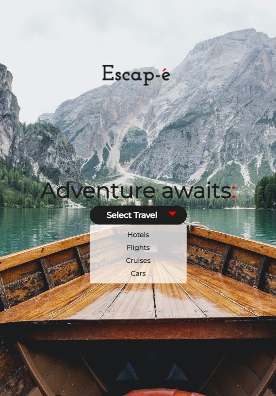

# Web Development Live Project

## Introduction
For this project, I was tasked to create a mock recipe website called, Cookery, as well as a travel destination mockup called, Escape-e. They both utilize vanilla HTML, CSS, and JavaScript to create a responsive and interactive website. This project displays my ability to create a website from scratch and implement new features and functionality as needed. 

---

## Cookery
Cookery is a mock recipe website that contains a responsive navbar, likes and comment annotations, and a search bar. The navbar is responsive and change size and transform when the scroll position is greater than 50px. The likes and comment annotations are interactive and change value when clicked.

### Navbar
The navbar is responsive and change size and transform when the scroll position is greater than 50px. The navbar also contains a search bar that is responsive and changes size when the screen size is less than 768px.

```javascript
 const navbar = $('.navbar');
const navbarHeight = navbar.outerHeight();

$(window).on('scroll', () => {
  const scrollTop = $(window).scrollTop();
  if (scrollTop >= navbarHeight) {
    navbar.removeClass('reset-nav');
    navbar.addClass('nav-scroll');
  } else {
    navbar.removeClass('nav-scroll');
    navbar.addClass('reset-nav');
    setTimeout(function () {
      navbar.removeClass('reset-nav');
    }, 1000);
  }
});
```


### Likes and Comments
The likes and comment annotations are interactive and change value when clicked. The likes and comments are stored in an array and are displayed on the page. The user can click on the like and comment buttons to increase the value of the likes and comments. The user can also click on the comment button to display a comment form and apply a star rating to the recipe.

```javascript
const heart = $('.fa-heart');
const heartCount = $('.heart-count');
let count = 0;

heart.on('click', () => {
  count++;
  heartCount.text(count);
});


const commentModal = $('#commentModal');
const commentBtn = $('#commentModalButton');
const messageCount = $('.message-count');
let commentCounter = 0;

commentBtn.on('click', () => {
  $('#commentModal').modal('show');
  commentCounter++;
  messageCount.text(commentCounter);
});

const starRating = $('.fa-star');

starRating.on('click', (e) => {
  $(e.target).addClass('checked');
  $(e.target).prevAll().addClass('checked');
  $(e.target).nextAll().removeClass('checked');
});
```


---
## Escape-e
Escape-e is a mock travel destination website that contains a responsive navbar. The navbar contains both mobile and desktop menus.

### Navbar
The navbar is responsive and change the size of the dropdown menu to the current size of the navbar. It also resizes in response to mobile and desktop screens.

```javascript
const dropdownMenu = document.querySelector(".dropdown-menu");
const button = document.getElementById("dropdownMenuButton");

$(button).click(function () {
    $(dropdownMenu).css("width", $(button).outerWidth());
});
```




---

## Conclusion
This project was a great opportunity to showcase my skills in HTML, CSS, and JavaScript. I was able to create a responsive and interactive website that displays my ability to create a website from scratch and implement new features and functionality as needed. I was also able to learn new skills and techniques to create a better user experience.
